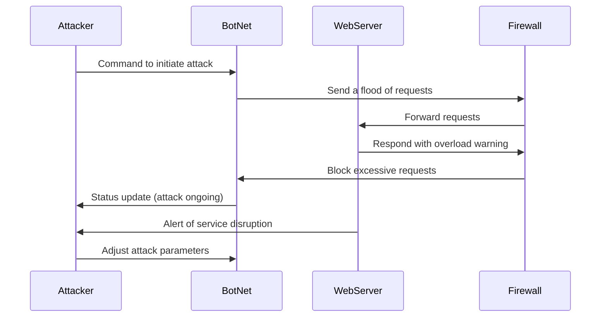

# Distributed Denial of Service Attack, Sequence Diagram

## Steps
1. Attacker sends a command to the BotNet to initiate a flood of requests.
2. BotNet sends a large volume of requests to the Firewall.
3. The Firewall attempts to forward these requests to the WebServer.
4. The WebServer notifies the Firewall about an overload, signaling that it is being overwhelmed.
5. The Firewall then blocks excessive requests from the BotNet to mitigate the attack.
6. The BotNet provides status updates to the Attacker regarding the ongoing attack.
7. Finally, the Attacker may adjust the parameters of the attack based on feedback from the WebServer.
